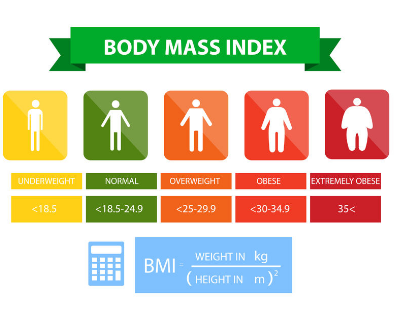

# BMI-Calculator

This is a simple BMI (Body Mass Index) calculator implemented in HTML, CSS, and JavaScript. It allows users to input their height in centimeters and weight in kilograms, and it calculates their BMI.

## Description

The BMI calculator calculates the BMI using the formula:

\[ \text{BMI} = \frac{\text{weight (kg)}}{\text{height (m)}^2} \]

Based on the calculated BMI, it provides information about the user's weight status, whether they are underweight, normal, overweight, obese, or extremely obese.

## Live Demo

You can try out the live BMI calculator [here](https://abedalmajed.github.io/BMI-Calculator/).

## Screenshots

## Features

- Input fields for height (in centimeters) and weight (in kilograms).
- Error messages for incorrect inputs.
- Calculation of BMI and display of weight status.
- Reset button to clear input fields.

## Usage

1. Enter your height in centimeters in the "Height in CM" field.
2. Enter your weight in kilograms in the "Weight in KG" field.
3. Click on the "Calculate" button or press Enter to calculate your BMI.
4. View your BMI and weight status displayed below.
5. Optionally, click on the "Clear" button to reset the input fields.

Enjoy calculating your BMI!

